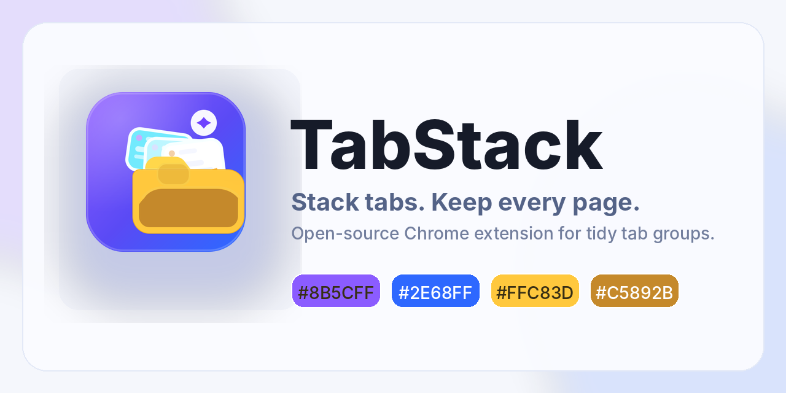

  
 
[🇨🇳 中文](README_zh.md) | [🇬🇧 English](README.md)

  
A smart and lightweight Chrome extension that helps you declutter your browser using native Chrome Tab Groups.

## ✨ Key Features

* 📦 **One-Click Stacking:** Quickly group scattered, ungrouped tabs into neat "stacks" directly from the popup menu.
* 🗂️ **Dedicated Manager Dashboard:** A spacious, focused window to easily move tabs in and out of specific stacks, open tabs, or dissolve stacks completely.
* 🔍 **Powerful Search:** Instantly find any stack, tab title, or specific URL right from the popup or the manager interface.
* 🤖 **Smart Naming & Auto-coloring:** Automatically names the stack based on the first tab inside it and assigns a visually distinct color.
* 🚀 **Native Integration:** Built on top of Chrome's native Tab Groups for a seamless, lightweight, and crash-free experience.
* 🌐 **Bilingual Support:** Instantly toggle between English and Simplified Chinese at any time.

## 📸 Interface Preview (Logical Flow)

### 1. Quick Popup Menu (Your Control Center)
Manage existing stacks or create new ones instantly from the extension popup. This is where you quickly tidy up your current window.

### 2. Dedicated Manager Dashboard (Deep Control)
Need more space? Open any stack in the spacious manager dashboard. Drag-and-drop tabs, search efficiently, and manage everything without squeezing into a tiny dropdown.

### 3. The Result: Clean Native Experience
This is how your browser looks after using TabStack. All your open tabs are beautifully organized into native Chrome Tab Groups, ready for you to focus.

## 📥 Installation (Developer Mode)

Since this extension is open-source, you can easily load it into your Chrome browser:

1. Clone or download this repository to your local machine.
2. Open Google Chrome and navigate to `chrome://extensions/`.
3. Enable **Developer mode** by toggling the switch in the top right corner.
4. Click the **Load unpacked** button and select the directory where you extracted this project.
5. The TabStack icon should now appear in your browser toolbar!

## 📄 License

This project is licensed under the MIT License.
