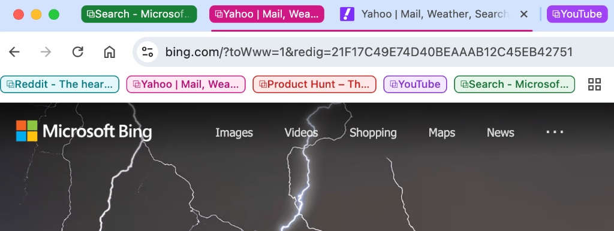
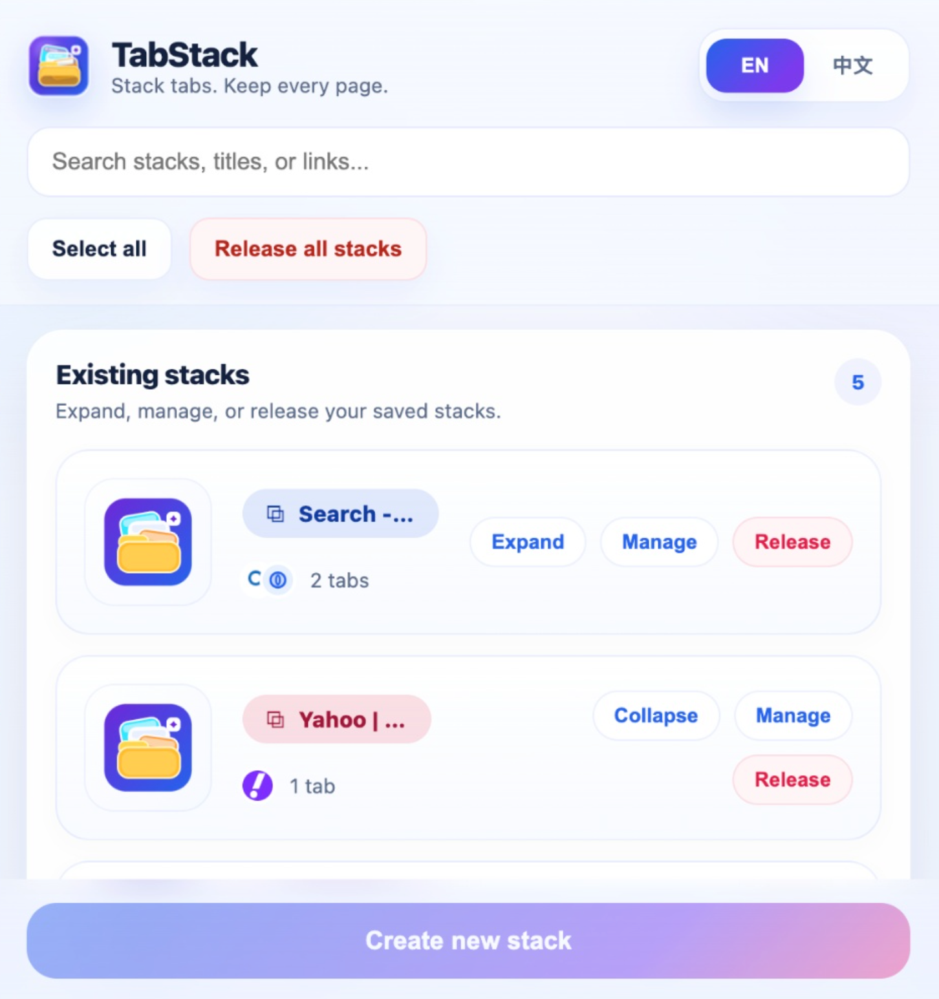
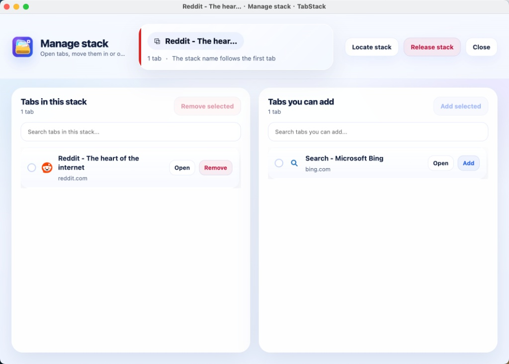

# TabStack 📦

[🇨🇳 中文](README_zh.md) | [🇬🇧 English](README.md)

**Stack tabs. Keep every page.**

A smart and lightweight Chrome extension that helps you declutter your browser using native Tab Groups.

## ✨ Key Features

* 📦 **One-Click Stacking:** Quickly group scattered, ungrouped tabs into neat "stacks" directly from the popup menu.
* 🗂️ **Dedicated Manager Dashboard:** A spacious, focused window to easily move tabs in and out of specific stacks, open tabs, or dissolve stacks completely.
* 🔍 **Powerful Search:** Instantly find any stack, tab title, or specific URL right from the popup or the manager interface.
* 🤖 **Smart Naming & Auto-coloring:** Automatically names the stack based on the first tab inside it and assigns a visually distinct color.
* 🚀 **Native Integration:** Built on top of Chrome's native Tab Groups for a seamless, lightweight, and crash-free experience.
* 🌐 **Bilingual Support:** Instantly toggle between English and Simplified Chinese at any time.

## 📸 Interface Preview

### 1. Quick Popup Menu
Manage existing stacks or create new ones instantly from the extension popup.

### 2. Dedicated Manager Dashboard
A spacious window to move tabs in and out, locate stacks, and manage everything without squeezing into a tiny dropdown.

## 🛠️ How to Use

1. **Create a Stack:** Click the TabStack icon in your toolbar, select the ungrouped tabs you want to organize, and click "Create new stack".
2. **Manage a Stack:** Click the "Manage" button on any existing stack in the popup to open the detailed manager dashboard.
3. **Release a Stack:** Done with a topic? Click "Release" to ungroup the tabs without closing them, returning them to your main browser window.
4. **Locate a Stack:** Lost your tabs among dozens of open pages? Use the "Locate stack" button in the manager to instantly bring the group to the front.

## 📥 Installation (Developer Mode)

Since this extension is open-source, you can easily load it into your Chrome browser:

1. Clone or download this repository to your local machine.
2. Open Google Chrome and navigate to `chrome://extensions/`.
3. Enable **Developer mode** by toggling the switch in the top right corner.
4. Click the **Load unpacked** button and select the directory where you extracted this project.
5. The TabStack icon should now appear in your browser toolbar!

## 📄 License

This project is licensed under the MIT License.
