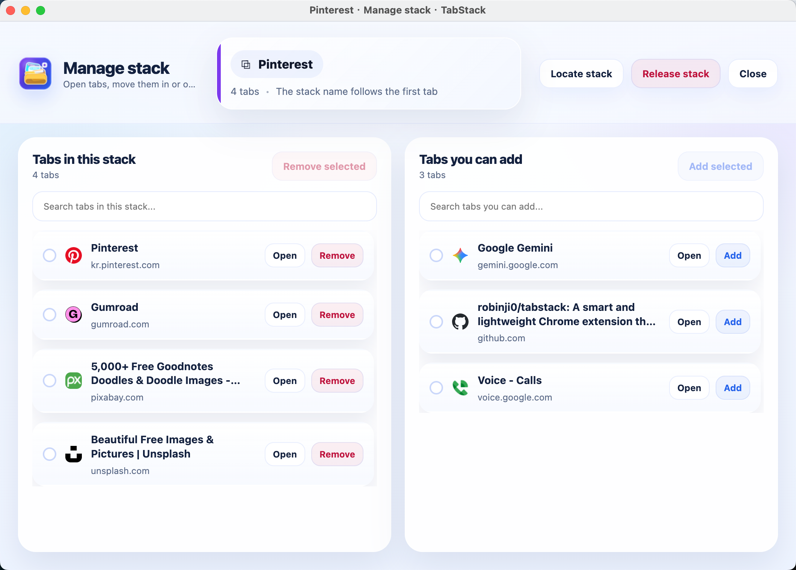

  
  <h1 align="center">TabStack (Tab 收纳)</h1>
  
<b>收纳标签，不丢页面。</b>

  
[🇨🇳 中文](README_zh.md) | [🇬🇧 English](README.md)

  
一款轻量智能的 Chrome 浏览器扩展，利用原生标签组功能，帮你告别浏览器标签页的凌乱。

## ✨ 核心功能

* 📦 **一键收纳:** 在扩展弹窗中快速勾选未分组的标签页，一键将它们打包成整洁的“收纳组”。
* 🗂️ **专属管理面板:** 提供宽敞、专注的独立管理窗口，轻松实现标签的移入、移出、快速定位或释放整个收纳。
* 🔍 **全局高效搜索:** 无论是查找收纳名称、特定的网页标题还是 URL 链接，都可以在搜索框中瞬间找到。
* 🤖 **智能命名与配色:** 根据收纳组内的第一个标签页自动生成准确的名称，并分配高辨识度的颜色。
* 🚀 **原生级体验:** 深度集成 Chrome 原生的标签组（Tab Groups）功能，不占用额外内存，体验极致流畅。
* 🌐 **无缝双语支持:** 内置英文与简体中文，随时一键切换，完美适应你的语言习惯。

## 📸 界面预览 (用户使用逻辑)

### 1. 快捷弹窗菜单 (你的控制中心)
在扩展弹窗中快速管理已有收纳，或一键勾选创建新收纳。这里是你快速整理当前窗口的入口。

### 2. 独立管理面板 (深度管理)
需要更多空间？在独立且宽敞的管理窗口中打开任意收纳组。在这里你可以自由地批量移入、移出标签，告别拥挤狭小的下拉菜单。

### 3. 原生标签组效果图 (最终成果)
这是使用 TabStack 收纳后的浏览器效果。你所有的标签页都被整洁地归纳在 Chrome 原生的标签组中，即刻开启专注模式。

## 📥 本地安装指南 (开发者模式)

你可以通过 Chrome 的开发者模式轻松加载并使用此扩展：

1. 克隆或下载本仓库的源码到本地电脑。
2. 打开 Chrome 浏览器，在地址栏输入并访问 `chrome://extensions/`。
3. 打开页面右上角的 **开发者模式** 开关。
4. 点击左上角的 **加载已解压的扩展程序** 按钮，选择本项目的文件夹目录。
5. TabStack 图标就会出现在你的浏览器工具栏中啦！

## 📄 开源协议

本项目采用 MIT License 开源协议。
